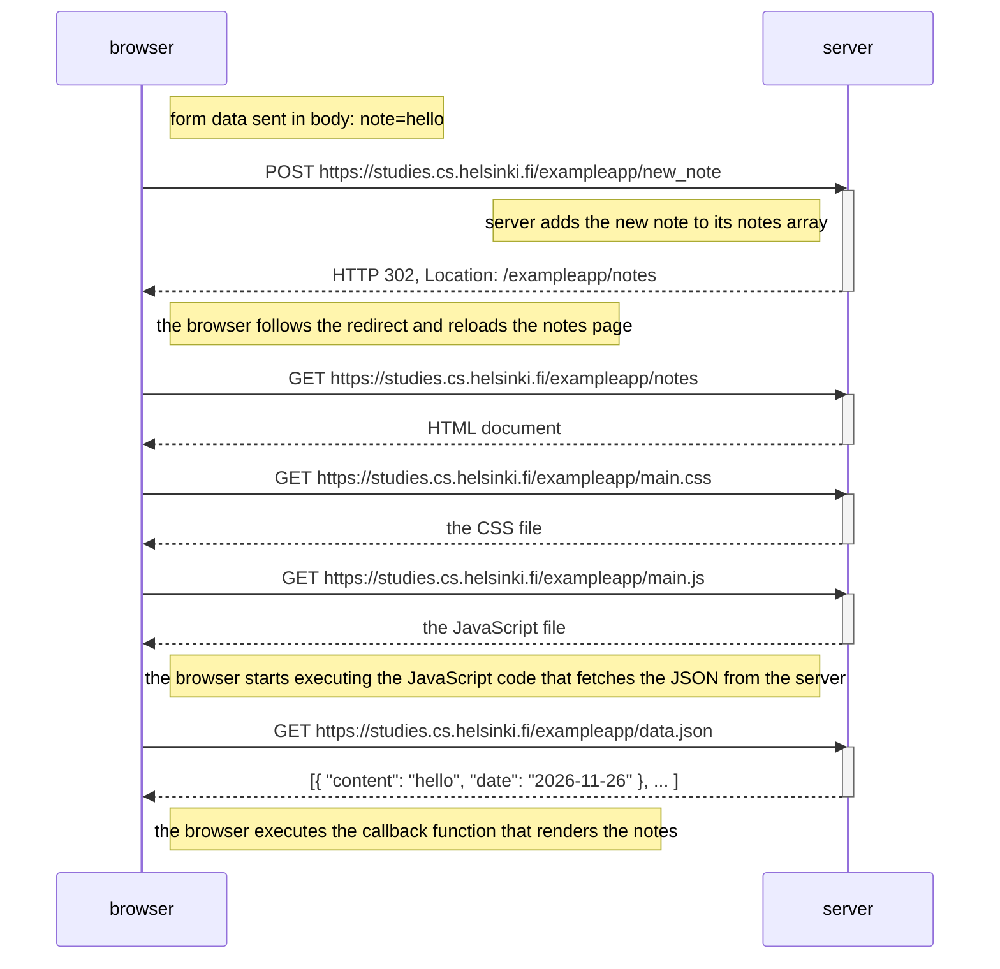

```mermaid
sequenceDiagram
    participant browser
    participant server

    Note right of browser: form data sent in body: note=hello
    browser->>server: POST https://studies.cs.helsinki.fi/exampleapp/new_note
    activate server
    Note left of server: server adds the new note to its notes array
    server-->>browser: HTTP 302, Location: /exampleapp/notes
    deactivate server

    Note right of browser: the browser follows the redirect and reloads the notes page

    browser->>server: GET https://studies.cs.helsinki.fi/exampleapp/notes
    activate server
    server-->>browser: HTML document
    deactivate server

    browser->>server: GET https://studies.cs.helsinki.fi/exampleapp/main.css
    activate server
    server-->>browser: the CSS file
    deactivate server

    browser->>server: GET https://studies.cs.helsinki.fi/exampleapp/main.js
    activate server
    server-->>browser: the JavaScript file
    deactivate server

    Note right of browser: the browser starts executing the JavaScript code that fetches the JSON from the server

    browser->>server: GET https://studies.cs.helsinki.fi/exampleapp/data.json
    activate server
    server-->>browser: [{ "content": "hello", "date": "2026-11-26" }, ... ]
    deactivate server

    Note right of browser: the browser executes the callback function that renders the notes
```
