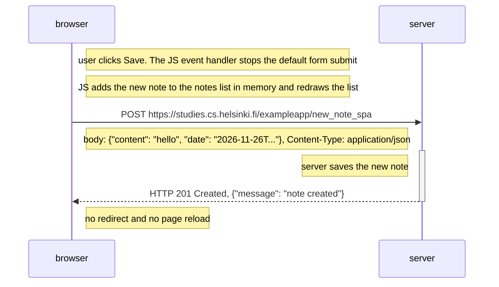

```mermaid
sequenceDiagram
    participant browser
    participant server

    Note right of browser: user clicks Save. The JS event handler stops the default form submit
    Note right of browser: JS adds the new note to the notes list in memory and redraws the list

    browser->>server: POST https://studies.cs.helsinki.fi/exampleapp/new_note_spa
    Note right of browser: body: {"content": "hello", "date": "2026-11-26T..."}, Content-Type: application/json
    activate server
    Note left of server: server saves the new note
    server-->>browser: HTTP 201 Created, {"message": "note created"}
    deactivate server

    Note right of browser: no redirect and no page reload
```
